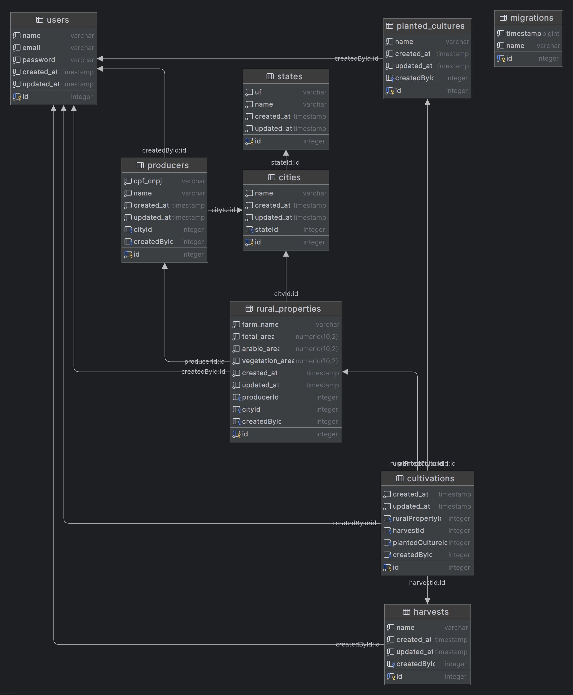

<p align="center">
  <a href="http://nestjs.com/" target="blank"></a>
</p>

[circleci-image]: https://img.shields.io/circleci/build/github/nestjs/nest/master?token=abc123def456
[circleci-url]: https://circleci.com/gh/nestjs/nest

  <p align="center">A progressive <a href="http://nodejs.org" target="_blank">Node.js</a> framework for building efficient and scalable server-side applications.</p>
    <p align="center">
<a href="https://www.npmjs.com/~nestjscore" target="_blank"></a>
<a href="https://www.npmjs.com/~nestjscore" target="_blank"></a>
<a href="https://www.npmjs.com/~nestjscore" target="_blank"></a>
<a href="https://circleci.com/gh/nestjs/nest" target="_blank"></a>
<a href="https://discord.gg/G7Qnnhy" target="_blank"></a>
<a href="https://opencollective.com/nest#backer" target="_blank"></a>
<a href="https://opencollective.com/nest#sponsor" target="_blank"></a>
  <a href="https://paypal.me/kamilmysliwiec" target="_blank"></a>
    <a href="https://opencollective.com/nest#sponsor"  target="_blank"></a>
  <a href="https://twitter.com/nestframework" target="_blank"></a>
</p>
  <!--[](https://opencollective.com/nest#backer)
  [](https://opencollective.com/nest#sponsor)-->

# Brain Agriculture - API de Produtores Rurais

Esta aplicação é parte de um teste técnico e tem como objetivo o cadastro e gestão de produtores rurais, suas propriedades, culturas e safras.

## Tecnologias

- [NestJS](https://nestjs.com/)
- [PostgreSQL](https://www.postgresql.org/)
- [TypeORM](https://typeorm.io/)
- [Docker](https://www.docker.com/)
- [Swagger](https://swagger.io/)
- [Jest](https://jestjs.io/)

### Requisitos

- Node.js 22.15.0
- Postgresql 17

## Como rodar o projeto com Docker

```bash
# Clonar o projeto
git clone https://github.com/wigorpaulo/brain_agriculture_back.git
cd brain-agriculture

# Subir os containers
docker-compose up --build

```

A API estará disponível em: http://localhost:3000

# Rodar testes

```bash
# Testes unitários
npm run test

# e2e tests
$ npm run test:e2e

# Testes com cobertura
npm run test:cov
```

# Documentação da API

A documentação Swagger estará disponível em:

http://localhost:3000/api

# Requisitos implementados

- Cadastro de produtores rurais

- Validação de CPF/CNPJ

- Relacionamento entre propriedades, culturas e safras

- Dashboard com estatísticas e gráficos

- Testes unitários e integração

- Swagger com contrato da API

- Docker com PostgreSQL

- Logs com Logger do NestJS

# Bônus: Se conseguir disponibilizar a aplicação na nuvem e acessível via internet, será um diferencial!

Sistema disponivel: https://brain-agriculture-back.fly.dev/

A documentação Swagger estará disponível em: https://brain-agriculture-back.fly.dev/api

## Diagrama do banco de dados

